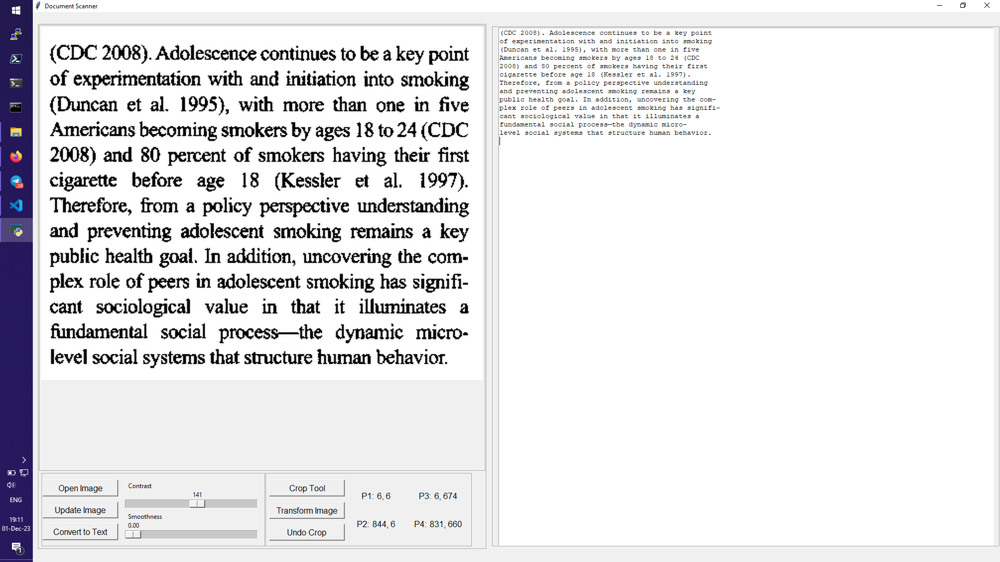

[](https://classroom.github.com/a/FI-MP__o)
[](https://classroom.github.com/online_ide?assignment_repo_id=13019676&assignment_repo_type=AssignmentRepo)

# Final Project
Upload your final project files to this repo, commit the necessary changes directly here or clone it to your local machine IDE then push the updated version back the cloud of github. With the second choice, you may need to follow the following steps:

step 1: accept the lab invitation you received, it will take you to the GitHub Classroom lab.

step 2: you will see a repository link form the lab assingment page, click on the link to open the respository on GitHub

step 3: clone the repo to your local manchine alternatively, you can create a new branch in the repo, or close to local machine or create a new branch on github.

step 4: create of modify the necessary files to complete the lab assingment.

step 5: after making changes, add, and commit then to your local repo and also push to the remote repo.

# Project details

To run the project you need [Python](https://www.python.org/downloads/) 3.6+ and also need to install the following packages or run requirements.py file:
```
pip install numpy
pip install opencv-python
pip install pytesseract
pip install pillow
pip install pywin32
```
You also need to install tesseract-ocr from the following link:
[Tesseract OCR installation](https://tesseract-ocr.github.io/tessdoc/Installation.html)

This is a project base on Tesseract OCR and OpenCV to detect and recognize text in images. What
I have done is just to build a GUI for it. The GUI is built by using Tkinter. The GUI is very simple. I have also added some features to this project for example the user are able to control
the contrast, smoothness, crop/transform the image.

# How to use the GUI

The UI is very easy and understandable to use. The user just need to select the image and then
click on the button to start the process. The user can also change the contrast and smoothness
of the image. The user can also crop the image and transform the image. The user can also
paste the image from clipboard (ctrl+v) to the application and start working on it. If you do
ctrl + c, the text will be copy to your clipboard.

# limitations

This project is not perfect. It has some limitations. Because of the Tesseract OCR, it is not
really good at recognizing the text in the image if it is hand written text. However, if the text
is typed, it will work perfectly. The other limitation is that the user can only select one image
at a time. The user can not select multiple images at a time. The other limitation is that the user can not save the image. The user can only save the text. The other limitation is that the user can not select the language. The user can only select the language from the code.


